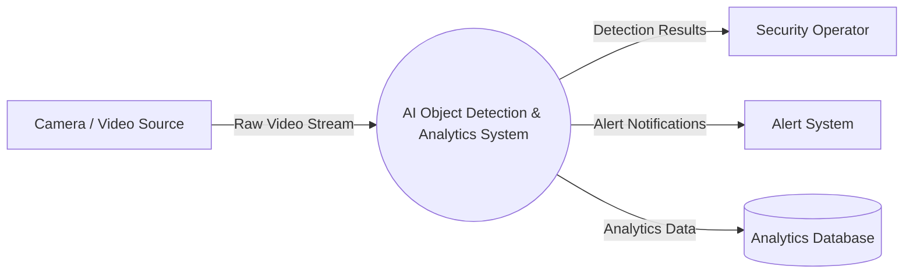
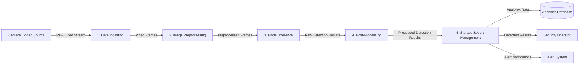

# End-to-End System Design Specification

## AI Object Detection and Analytics System

---

## 1. System Overview

The AI Object Detection and Analytics System is a Computer Vision application that receives video data from a camera, preprocesses the incoming frames, performs AI-based object detection, processes the detection results, and stores the results or generates alerts.

The system is designed as a modular architecture in which each major function is handled by an independent software module.

### Overall System Flow

```text
Camera / Video Source
        |
        v
Data Ingestion
        |
        v
Image Preprocessing
        |
        v
Model Inference
        |
        v
Post-Processing
        |
        v
Storage / Alert Management
        |
        +-----------> Analytics Database
        |
        +-----------> Security Operator
        |
        +-----------> Alert System
```

---

# 2. Functional Requirements

| ID    | Functional Requirement                                                      |
| ----- | --------------------------------------------------------------------------- |
| FR-01 | The system shall capture video from the camera or video source.             |
| FR-02 | The system shall process video frames and detect objects using an AI model. |
| FR-03 | The system shall process and organize object detection results.             |
| FR-04 | The system shall store analytics and detection results.                     |
| FR-05 | The system shall generate alerts when specified conditions are detected.    |

---

# 3. Non-Functional Requirements

| ID     | Non-Functional Requirement                                                                |
| ------ | ----------------------------------------------------------------------------------------- |
| NFR-01 | The system shall provide reliable object detection under normal operating conditions.     |
| NFR-02 | Video frames should be processed with minimal delay.                                      |
| NFR-03 | The system should maintain an adequate processing frame rate.                             |
| NFR-04 | Detection and analytics data shall be protected from unauthorized access.                 |
| NFR-05 | The system should operate within the available memory, processing, and network resources. |

---

# 4. System Actors and Users

| Actor/User            | Role                                                  |
| --------------------- | ----------------------------------------------------- |
| Camera / Video Source | Provides live video data to the system.               |
| Security Operator     | Monitors detection results and system alerts.         |
| Administrator         | Manages system configuration and stored data.         |
| Alert System          | Receives alert notifications generated by the system. |

---

# 5. System Boundary

### Inside the System

* Data ingestion
* Image preprocessing
* AI model inference
* Detection post-processing
* Alert management
* Analytics data storage

### Outside the System

* Camera / video source
* Security operator
* Administrator
* External alert endpoint

The system boundary separates the internal processing components from the external entities that interact with the system.

---

# 6. Input and Output Mapping

## 6.1 System Inputs

| Input                | Source                | Description                                        |
| -------------------- | --------------------- | -------------------------------------------------- |
| Raw Video Stream     | Camera / Video Source | Incoming video containing objects to be detected.  |
| Video Frames         | Data Ingestion        | Individual frames extracted from the video stream. |
| System Configuration | Administrator         | Configuration required for system operation.       |

## 6.2 System Outputs

| Output              | Destination        | Description                                              |
| ------------------- | ------------------ | -------------------------------------------------------- |
| Detection Results   | Security Operator  | Information about objects detected in the video.         |
| Analytics Data      | Analytics Database | Detection information stored for later analysis.         |
| Alert Notifications | Alert System       | Notifications generated when specified conditions occur. |
| Log Entries         | Storage            | Records of system and detection events.                  |

---

# 7. Operational Constraints

| Constraint        | Description                                                                     |
| ----------------- | ------------------------------------------------------------------------------- |
| Processing Speed  | Video frames should be processed with minimal delay.                            |
| Memory Usage      | The system must operate within the available memory of the processing device.   |
| Network Bandwidth | Video and system data transmission must remain within available bandwidth.      |
| Camera Quality    | The camera must provide sufficient image quality for reliable detection.        |
| Data Privacy      | Stored detection and analytics data must be protected from unauthorized access. |

---

# 8. Level 0 Data-Flow Diagram

The Level 0 DFD represents the complete AI Object Detection and Analytics System as a single process.



---

# 9. Level 1 Data-Flow Diagram

The Level 1 DFD decomposes the system into its major processing stages.



---

# 10. Modular Software Architecture

The system is divided into four core software modules.

```text
Camera / Video Source
        |
        v
+----------------------+
| DataIngestion        |
+----------------------+
        |
        v
+----------------------+
| ImagePreprocessor    |
+----------------------+
        |
        v
+----------------------+
| ModelInferenceEngine |
+----------------------+
        |
        v
+----------------------+
| AlertLogger          |
+----------------------+
        |
        v
Database / Alert System
```

---

# 11. DataIngestion Module

### Responsibility

The `DataIngestion` module receives video or image data from the camera or video source.

### Interface

```python
from typing import Any


class DataIngestion:
    """Handles input data from the camera or video source."""

    def __init__(self, source: str) -> None:
        self.source = source

    def read_frame(self) -> Any:
        """Read one frame from the video source."""
        pass

    def release(self) -> None:
        """Release the video source."""
        pass
```

### Input

* Camera or video source

### Output

* Video frame

---

# 12. ImagePreprocessor Module

### Responsibility

The `ImagePreprocessor` module prepares video frames for AI model inference.

### Interface

```python
from typing import Any


class ImagePreprocessor:
    """Prepares input images for AI model inference."""

    def resize(self, frame: Any, width: int, height: int) -> Any:
        """Resize an image frame."""
        pass

    def normalize(self, frame: Any) -> Any:
        """Normalize image values."""
        pass

    def preprocess(self, frame: Any) -> Any:
        """Perform complete preprocessing."""
        pass
```

### Input

* Raw video frame
* Target dimensions

### Output

* Preprocessed frame

---

# 13. ModelInferenceEngine Module

### Responsibility

The `ModelInferenceEngine` loads the AI model and performs object detection on preprocessed frames.

### Interface

```python
from typing import Any


class ModelInferenceEngine:
    """Runs the AI object detection model."""

    def __init__(self, model_path: str) -> None:
        self.model_path = model_path

    def load_model(self) -> None:
        """Load the AI model."""
        pass

    def predict(self, frame: Any) -> Any:
        """Run object detection on a preprocessed frame."""
        pass
```

### Input

* Preprocessed frame
* AI model

### Output

* Object detection results

---

# 14. AlertLogger Module

### Responsibility

The `AlertLogger` module stores detection results and generates alerts for detected events.

### Interface

```python
from typing import Any


class AlertLogger:
    """Stores detection results and generates alerts."""

    def log_detection(self, detection: Any) -> None:
        """Store a detection result."""
        pass

    def generate_alert(self, detection: Any) -> str:
        """Generate an alert for a detected event."""
        pass

    def save_log(self, message: str) -> None:
        """Save an event message to the log."""
        pass
```

### Input

* Detection results
* Alert messages

### Output

* Stored logs
* Alert notifications

---

# 15. Module Communication

| Module               | Input               | Output             |
| -------------------- | ------------------- | ------------------ |
| DataIngestion        | Camera/video source | Video frame        |
| ImagePreprocessor    | Video frame         | Preprocessed frame |
| ModelInferenceEngine | Preprocessed frame  | Detection results  |
| AlertLogger          | Detection results   | Logs and alerts    |

---

# 16. End-to-End Data Flow

The complete system operates using the following sequence:

```text
Camera
   |
   v
DataIngestion
   |
   v
Video Frame
   |
   v
ImagePreprocessor
   |
   v
Preprocessed Frame
   |
   v
ModelInferenceEngine
   |
   v
Detection Results
   |
   v
Post-Processing
   |
   v
AlertLogger
   |
   +------> Analytics Database
   |
   +------> Security Operator
   |
   +------> Alert System
```

---

# 17. Summary

The proposed architecture separates the Computer Vision system into independent modules with clearly defined responsibilities and interfaces. The architecture supports the complete flow from video acquisition to preprocessing, AI inference, result processing, storage, and alert generation.

The modular design makes the system easier to develop, test, maintain, and extend because individual components can be modified without redesigning the entire system.
