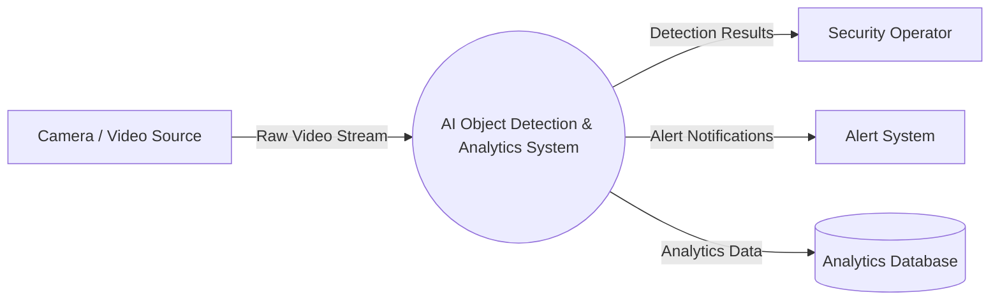
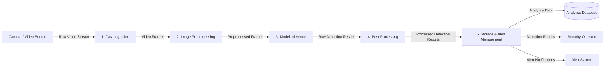

# Task 3: Data-Flow Diagram (DFD)

## AI Object Detection and Analytics System

### Level 0 — Context Diagram

The Level 0 DFD represents the complete AI object detection and analytics system as a single process and shows its interaction with external entities.

---

## Level 1 — Detailed Data-Flow Diagram

The Level 1 DFD decomposes the AI object detection and analytics system into its major processing stages.

### Data Flow Description

| Data Flow                   | Description                                                     |
| --------------------------- | --------------------------------------------------------------- |
| Raw Video           | Video received.                 |
| Video Frames                | Individual frames extracted     |
| Preprocessed Frames         | Frames prepared for model inference.                         |
| Detection Results       | Objects detected by the model.                               |
| Processed Detection Results | Filtered, organized detection results.                       |
| Analytics Data              | Detection information stored                |
| Alert Notifications         | Notifications generated during alerts |
